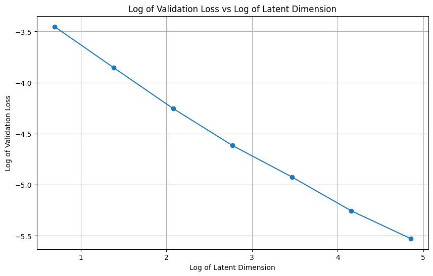

# Power law for autoencoders

Training an autoencoder I've noticed that the log lgo graph of a validation loss vs log dimension of latent space is linear. Here I test it for different datasets and the relationship seem to hold not beeing bottlenecked by the size of encoder and decoder. Similar realtionship can be found in [this](https://arxiv.org/pdf/2406.04093) paper (note that the loss model is slightly bottlenecked by the size of the encoder and decoder as authors try to make them smaller but generally the power  realtionship is evident)

  

## Understanding the phenomenon

 **Yet another power law? How is it different and why important?:**
   Compression seem to be closely related to complexity of the underlying structure of data and intelligence in general. The are several results considered being improtant like shannon bound and generally rate distortion theory yet this phenomenon seem not discussed yet. There is also quite immediate thread to manifold hypothesis which woudl impley that the loss would resemble the curve of the cumulative variance explaine by firsrt $n$ components of the data or at least their images under the encoder inside the latent space which is hower now the case. Possible explanations might include something like: how much data can be compressed into a space do dimesion $n$ can be though of being approximate by a number of linear direcitos in space pairwise distinguishable in some sence(in our case by decoder)and so if we assume that for decoder to distinguish features we need the directions to make an angle of at least epsilon pairwise we will find the number of such direction possible in $n$ dimensional space grows exponentially with $n$. Otherwise there might be some sort of discrete nature of data explanations which suggest(btw really interesting) questing like: take $k$ points uniformly randomly in $n$ dimensinonal ball. What is the expected numeber of points on the boundary of the convex hull of set of such points?$(O(log(k)^n))$.  

